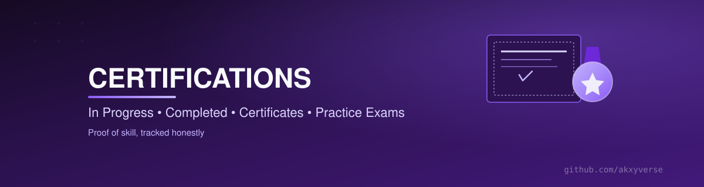
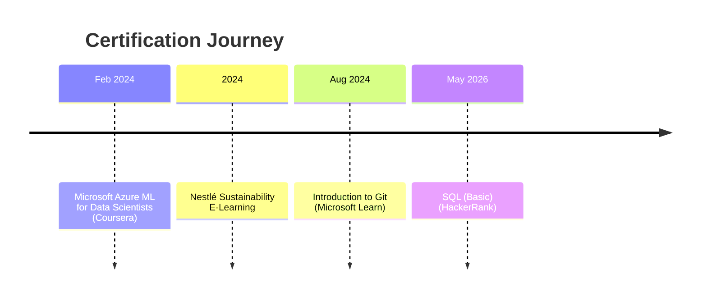

  

  

### 🏛️ The Achievement Gallery
### Proof, not just claims — a verified showcase of every certification earned, real credentials, real dates, real links.

 

<table>
<tr>
<td width="25%" align="center" valign="top">

**🧭 What**

Every certification I've earned, with verifiable credential links where available.

</td>
<td width="25%" align="center" valign="top">

**💡 Why**

Certifications are proof. A verified showcase separates earned from claimed.

</td>
<td width="25%" align="center" valign="top">

**👥 Who**

Recruiters wanting to verify credentials fast — and me, staying accountable.

</td>
<td width="25%" align="center" valign="top">

**🎁 Value**

A simple, honest system anyone can copy for their own certification tracking.

</td>
</tr>
</table>

### 🧭 Explore the Ecosystem

<table>
<tr>
<td align="center" width="12.5%"><a href="https://github.com/akxyverse"><b>🏠</b> Profile</a></td>
<td align="center" width="12.5%"><a href="https://github.com/akxyverse/data-analytics-knowledge-system"><b>🧠</b> Knowledge Hub</a></td>
<td align="center" width="12.5%"><a href="https://github.com/akxyverse/data-analytics-projects"><b>🚀</b> Projects</a></td>
<td align="center" width="12.5%"><a href="https://github.com/akxyverse/datasets"><b>📦</b> Datasets</a></td>
<td align="center" width="12.5%"><a href="https://github.com/akxyverse/data-analytics-resources"><b>📚</b> Resources</a></td>
<td align="center" width="12.5%"><a href="https://github.com/akxyverse/career-hub"><b>💼</b> Career</a></td>
<td align="center" width="12.5%"><a href="https://github.com/akxyverse/content-studio"><b>✍️</b> Content</a></td>
<td align="center" width="12.5%"><b>🏅</b> Certs</td>
</tr>
</table>

<a href="https://github.com/akxyverse/ai-automation"><b>🤖 AI Automation</b></a>

---

## 📊 Achievement Statistics

<table>
<tr>
<td width="25%" align="center">

### 5
**Certificates Earned**

</td>
<td width="25%" align="center">

### 4
**Platforms**
Microsoft · Coursera · HackerRank · Nestlé

</td>
<td width="25%" align="center">

### 3
**Skill Domains**
Version Control · Cloud ML · Databases

</td>
<td width="25%" align="center">

### 2024–2026
**Active Span**

</td>
</tr>
</table>

## 🏆 Certificate Gallery

| Certificate | Issuer | Date | Credential | Skills |
|---|---|---|---|---|
| [Introduction to Git](./Certificates/Introduction-to-Git-Microsoft-Learn-2024.pdf) | Microsoft Learn | Aug 2024 | [Verify ↗](https://learn.microsoft.com/en-us/users/akashyadav-0350/achievements/print/aenlz5r7) | `Git` `Version Control` |
| [Microsoft Azure Machine Learning for Data Scientists](./Certificates/Microsoft-Azure-ML-for-Data-Scientists-Coursera-2024.pdf) | Coursera (Microsoft-authorized) | Feb 2024 | ID `CAHS2AT4S49X` · [Verify ↗](https://coursera.org/verify/CAHS2AT4S49X) | `Azure ML` `Cloud` `Data Science` |
| [SQL (Basic)](./Certificates/SQL-Basic-HackerRank-2026.pdf) | HackerRank | May 2026 | ID `31F67476DF1C` | `SQL` `Databases` |
| [Nestlé E-Learning — Sustainability](./Certificates/Nestle-Sustainability-ELearning-2024.pdf) | Nestlé Connect | 2024 | — | `Sustainability` `Professional Development` |
| [Certificate of Appreciation — NBA & NAAC Peer Visit](./Certificates/NBA-NAAC-Certificate-of-Appreciation-DYPIT.pdf) | Dr. D.Y. Patil Institute of Technology | Date not specified on certificate | — | `Institutional Contribution` |

> The last entry is a recognition/appreciation certificate, not a technical skill credential — included for completeness, categorized separately below.

## 🗺 Learning Timeline

## 🧰 Skills & Technologies Gained

<table>
<tr>
<td width="50%" valign="top">

**Technical**

</td>
<td width="50%" valign="top">

**Professional**

</td>
</tr>
</table>

## 🗂 Certification Categories

<table>
<tr>
<td width="25%" align="center" valign="top">

🟡 **[In Progress](<./In Progress>)** Currently pursued

</td>
<td width="25%" align="center" valign="top">

✅ **[Completed](./Completed)** 5 finished

</td>
<td width="25%" align="center" valign="top">

🧾 **[Certificates](./Certificates)** 5 PDFs on file

</td>
<td width="25%" align="center" valign="top">

📝 **[Practice Exams](<./Practice Exams>)** Mock exam results

</td>
</tr>
</table>

## 🎯 How to Use This Repository

1. **Verifying a credential?** Every entry in the [Certificate Gallery](#-certificate-gallery) links directly to the issuer's verification page where one exists.
2. **Starting a new certification?** It goes in [`In Progress`](<./In Progress>) with a target date.
3. **Finished one?** It moves to [`Completed`](./Completed), the PDF goes in [`Certificates`](./Certificates), and this README's gallery gets updated — ready to reference from [Career Hub](https://github.com/akxyverse/career-hub).

## 🗺 Roadmap — What's Next

- 🟡 SQL (Intermediate/Advanced) — HackerRank
- 🟡 Power BI / Tableau official certification
- 🟡 A formal cloud certification (Azure Data Fundamentals or equivalent)

## ➡️ Recommended Next Repository

### 💼 [Career Hub](https://github.com/akxyverse/career-hub)
**Put it on the resume.** Every certification here is meant to show up there — including the internships that round out the full picture.

---

**⭐ Star this repo if the structure is useful to you.**

Part of the <a href="https://github.com/akxyverse"><b>Akxyverse</b></a> Data Analytics ecosystem · MIT Licensed (structure only — certificates are personal records) · <a href="./LICENSE">LICENSE</a>

